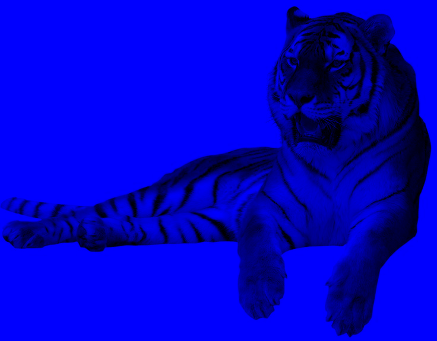

# Лабораторная работа №1
## Цветовые модели и передискретизация изображений

**Выполнил: Лазарев Ярослав Б23-514**

**Исходное изображение:** 

---

## 1. Цветовые модели

**1.1. Выделение компонентов R, G, B**

**1.2. Перевод в HSI, сохранение яркостной компоненты**

**1.3. Инвертирование яркостной компоненты**

---

## 2. Передискретизация

**2.1. Растяжение изображения в M=4 раза**

**2.2. Сжатие изображения в N=3 раза**

**2.3. Передискретизация в K=M/N≈1.33 раза (два прохода)**

**2.4. Передискретизация в K≈1.33 раза (один проход)**

  <b>ВЫВОД</b>

В ходе выполнения лабораторной работы были изучены и реализованы:

- Выделение и сохранение отдельных каналов R, G, B (функция rgb_components).
- Перевод изображения в модель HSI и сохранение яркостной компоненты I (функция rgb_to_hsi, формулы соответствуют лекции, стр. 16).
- Инвертирование яркости с применением к исходному RGB-изображению (функция invert_intensity).
- Растяжение изображения в M раз с помощью билинейной интерполяции (функция stretch).
- Сжатие изображения в N раз с усреднением по блоку (функция compress).
- Передискретизация в два прохода (stretch + compress, функция resample_two_pass).
- Передискретизация в один проход с коэффициентом K (функция resample_one_pass, для сжатия не использует усреднение, что приводит к алиасингу).

Результаты позволяют наглядно сравнить влияние разных подходов к передискретизации.

