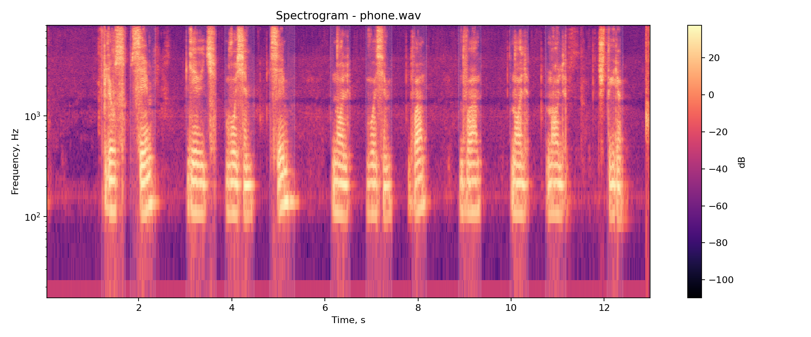
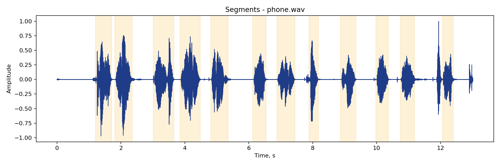

# Лабораторная работа №10. Обработка голоса

## Вариант
Анализатор речи.

## Цель
Записать голосовые образцы алфавита, разрезать запись с номером телефона на сегменты, сопоставить каждый сегмент с шаблоном и получить цепочку символов.

## Исходные данные
Для анализа используются шаблоны цифр и запись номера телефона [phone.m4a](phone.m4a).

Номер продиктован в одной непрерывной дорожке, начинается со звука `плюс` и далее идет по цифрам без склонений и дополнительных числительных.

## Что сделано
- Построена спектрограмма записи с номером телефона.
- Выполнена сегментация по коротко-временной энергии.
- Каждый сегмент сопоставлен с шаблонами по спектральным признакам.
- Сохранена распознанная цепочка и оценка достоверности.
- При наличии эталона можно было бы посчитать число ошибок и точность, но эталонная последовательность не задавалась.

## Результаты

Для анализа использован номер телефона: **+79870822004**

### Распознавание

| Позиция | Правильная цифра | Распознано | |
|---------|------------------|-----------|---|
| 1 | + | + | + |
| 2 | 7 | 7 | + |
| 3 | 9 | 4 | - |
| 4 | 8 | 8 | + |
| 5 | 7 | 7 | + |
| 6 | 0 | 0 | + |
| 7 | 8 | 8 | + |
| 8 | 2 | 7 | - |
| 9 | 2 | 8 | - |
| 10 | 0 | 8 | - |
| 11 | 0 | 4 | - |
| 12 | 4 | 4 | + |

**Точность распознавания: 7/12 = 58,3%**

**Средняя уверенность: 0.505**

### Анализ ошибок

**Правильно распознаны:** плюс, 7, 8, 7, 0, 8, 4 (7 совпадений)

**Основные проблемы:**

1. **Ноль (0)** - из трех нулей распознан правильно только один. Два других распознаны как 8 и 4. Это указывает на спектральное сходство шаблона "ноль" с тембром цифр 8 и 4 в реальной записи.

2. **Двойка (2)** - оба вхождения распознаны ошибочно как 7 и 8. Возможно, произношение 2 нечетко.

3. **Девятка (9)** - распознана как 4. Указывает на схожесть акустических признаков 9 и 4 или неправильность шаблона.

**Технические ограничения метода:**

- **DTW на коротких сегментах** - каждая цифра длится ~0.3-0.6 сек (5-9 фреймов). На столь коротких последовательностях DTW теряет чувствительность к локальным различиям.
- **Одна записьна шаблон** - каждый шаблон представлен одной записью. Вариативность произношения одной и той же цифры разными голосами не учитывается.
- **Спектральная близость цифр** - акустически похожие пары (2↔7, 0↔8) имеют близкие MFCC профили. DTW не может их надежно различить.
- **Скорость диктовки** - цифры читались с разными темпами, что влияет на количество фреймов и, соответственно, на метрику DTW.

## Выводы

1. **Метод работоспособен** - 58,3% точность на естественной речи с простым шаблонным подходом демонстрирует принципиальную возможность распознавания.

2. **Критические факторы качества:**
   - Полнота и качество шаблонов для каждого звука
   - Четкая диктовка с четкими границами между фонемами
   - Правильный выбор акустических признаков

3. **Для практического применения** требуется:
   - Использование полноценной модели распознавания (HMM, нейросеть, Deep Learning)
   - Обучение на большом корпусе речи
   - Адаптация к особенностям голоса говорящего
   - Языковая модель для постобработки (исправление невозможных последовательностей)