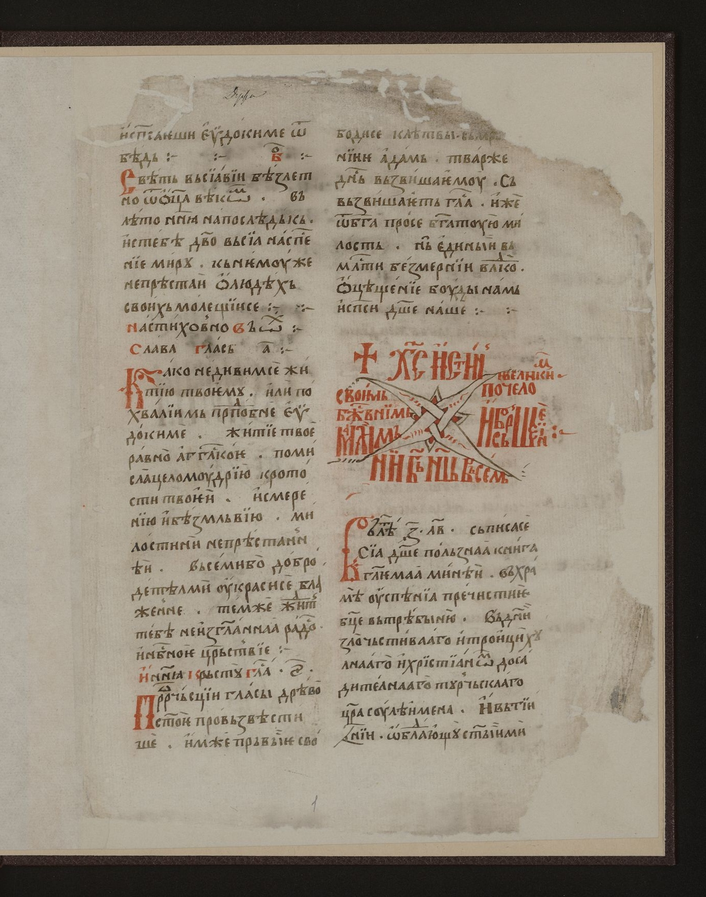
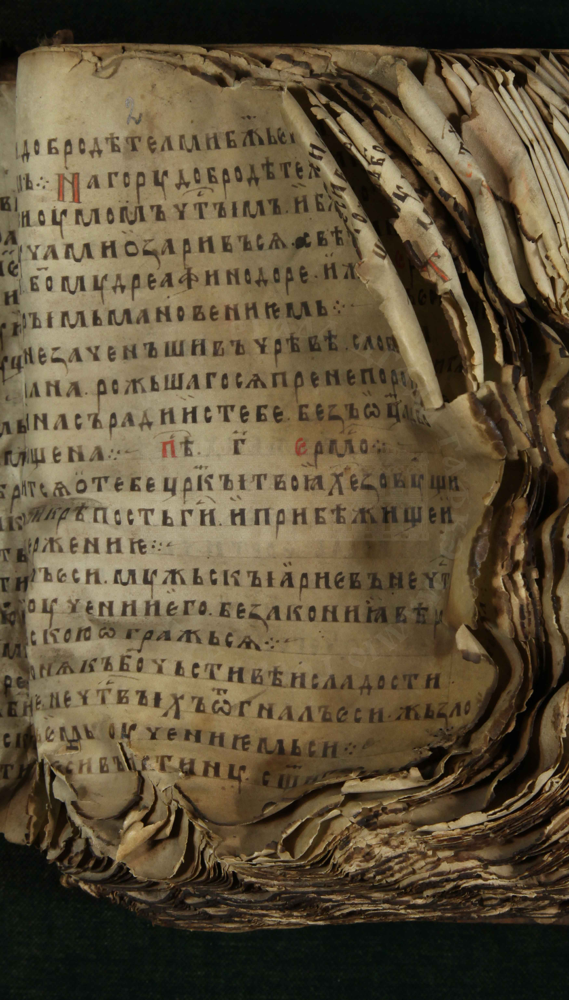
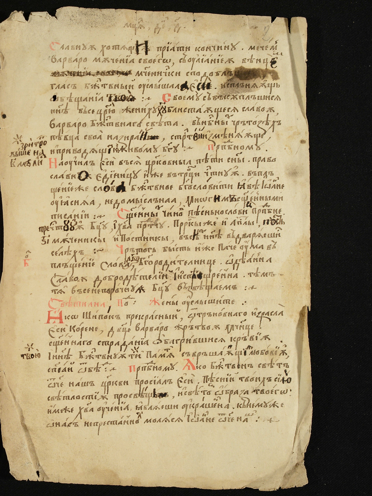
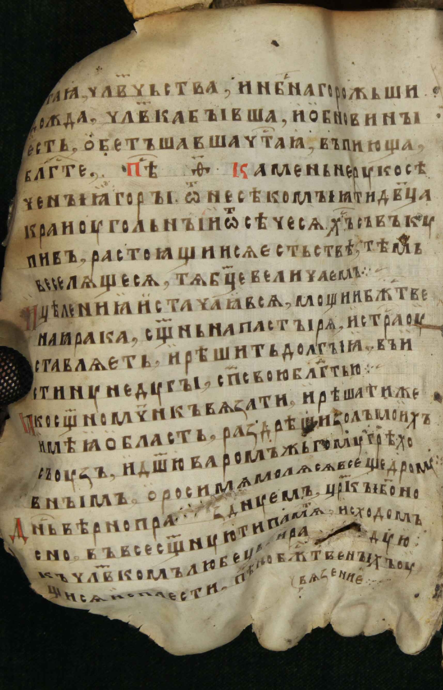
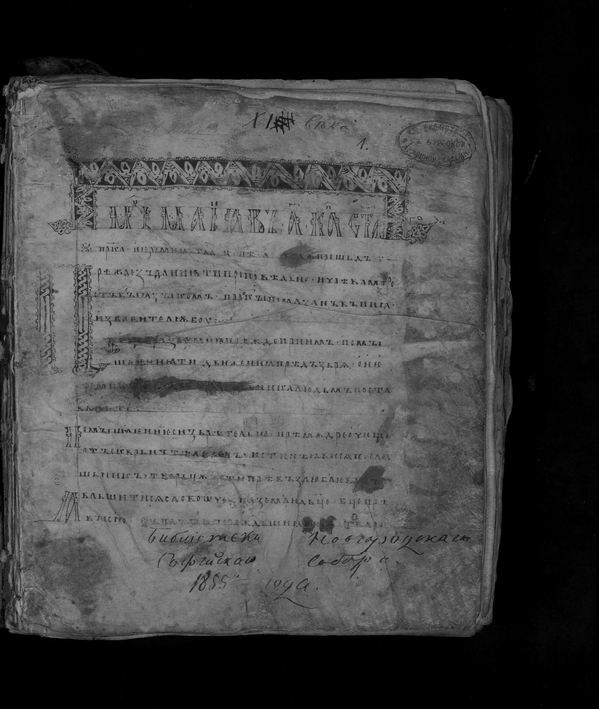
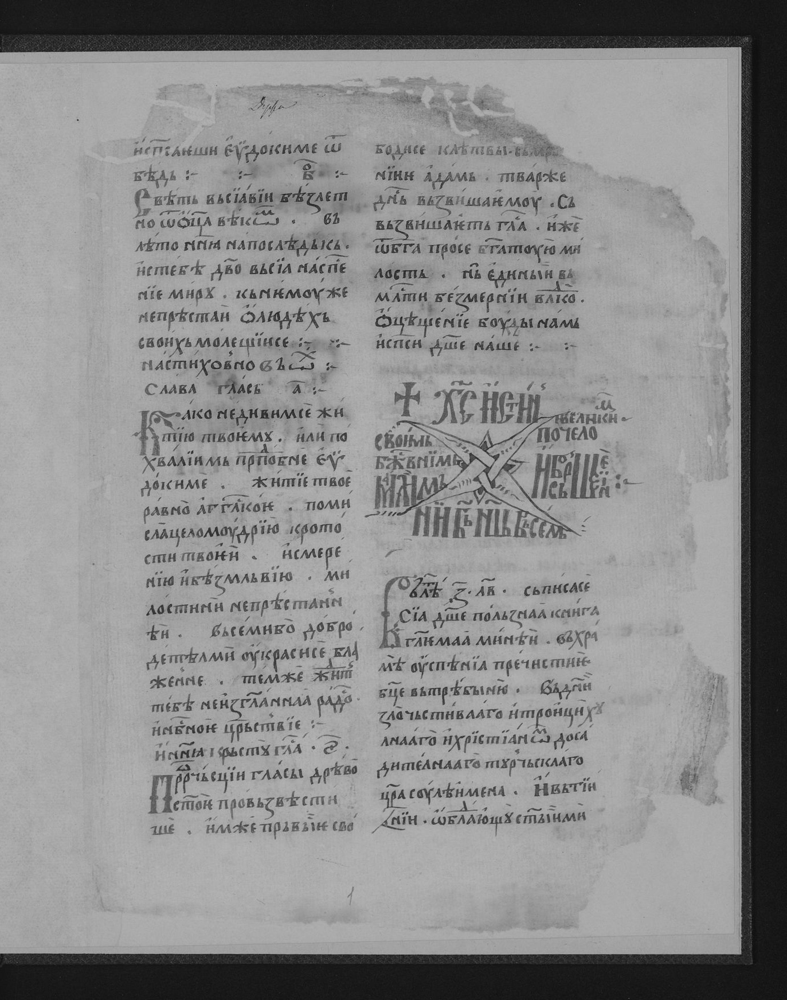
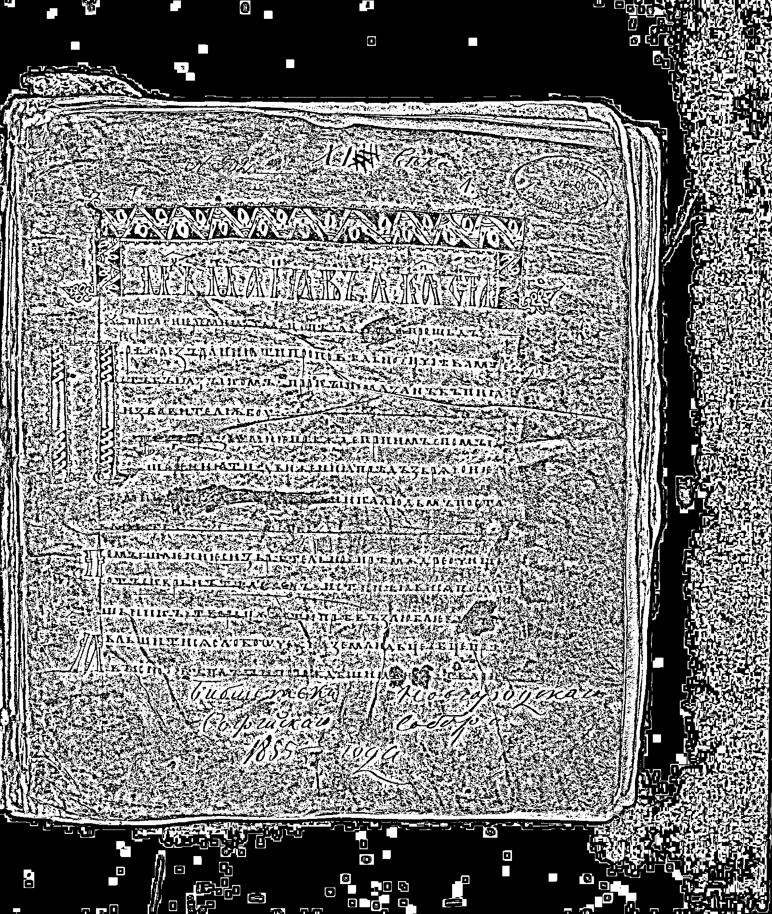
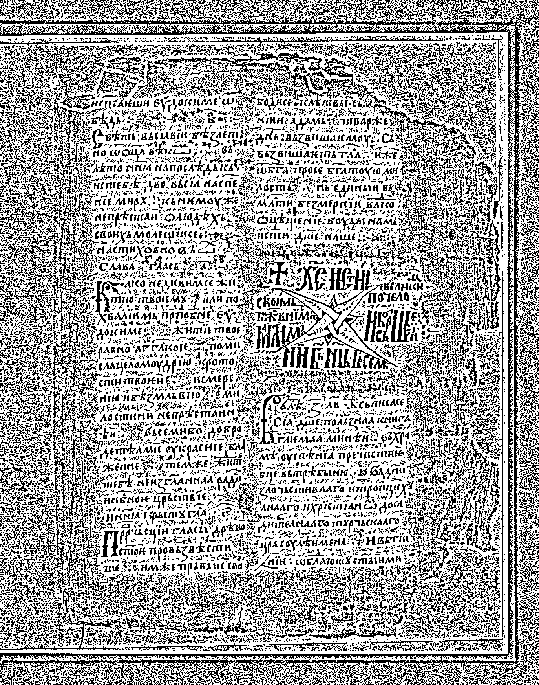

# Лабораторная работа №2
## Обесцвечивание и бинаризация растровых изображений

**Выполнил: Лазарев Ярослав Б23-514**

**Исходные изображения:**

---

## 1. Перевод в полутона

**Пример результата:**

---

## 2. Бинаризация методом NICK

**Пример результата:**

---

	<b>ВЫВОД</b>

В ходе выполнения лабораторной работы были реализованы:

- Перевод полноцветного изображения в полутона (ручное взвешенное усреднение каналов RGB).
- Бинаризация полутонового изображения методом NICK (адаптивный порог с учетом локального среднего и дисперсии).

Результаты показывают эффективность метода NICK для изображений с близкими по яркости текстом и фоном.

