# Лабораторная работа №5
## Выделение признаков символов

**Выполнил: Лазарев Ярослав Б23-514**

**Вариант: 12 (греческие заглавные буквы)**

Алфавит: `ΑΒΓΔΕΖΗΘΙΚΛΜΝΞΟΠΡΣΤΥΦΧΨΩ`

Параметры генерации эталонов:
- Шрифт: Times New Roman (при недоступности используется запасной шрифт).
- Кегль: 52.
- Формат хранения: 1 символ = 1 файл (`src/uXXXX.png`).
- Белые поля удаляются автоматической обрезкой по маске черных пикселей.

---

## 1. Эталонные изображения символов

| Код | Символ | Эталон |
|---|---|---|
| u0391 | Α |  |
| u0392 | Β |  |
| u0393 | Γ |  |
| u0394 | Δ | 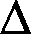 |
| u0395 | Ε |  |
| u0396 | Ζ |  |
| u0397 | Η |  |
| u0398 | Θ |  |
| u0399 | Ι |  |
| u039A | Κ |  |
| u039B | Λ | 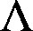 |
| u039C | Μ |  |
| u039D | Ν |  |
| u039E | Ξ |  |
| u039F | Ο |  |
| u03A0 | Π |  |
| u03A1 | Ρ |  |
| u03A3 | Σ | 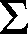 |
| u03A4 | Τ |  |
| u03A5 | Υ |  |
| u03A6 | Φ | 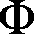 |
| u03A7 | Χ |  |
| u03A8 | Ψ | 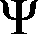 |
| u03A9 | Ω |  |

---

## 2. Набор рассчитанных признаков

Для каждого эталона рассчитаны признаки:
- Вес (масса черного) каждой четверти изображения: `mass_q1..mass_q4`.
- Удельный вес (нормировка на площадь четверти): `specific_q1..specific_q4`.
- Координаты центра тяжести: `cx`, `cy`.
- Нормированные координаты центра тяжести: `cx_norm`, `cy_norm`.
- Осевые моменты инерции по горизонтали и вертикали: `ix`, `iy`.
- Нормированные осевые моменты: `ix_norm`, `iy_norm`.
- Профили `X` и `Y`.

Скалярные признаки сохранены в файл:
- `results/features.csv` (разделитель `;`).

Фрагмент CSV:

```text
symbol;codepoint;width;height;mass_q1;mass_q2;mass_q3;mass_q4;specific_q1;specific_q2;specific_q3;specific_q4;cx;cy;cx_norm;cy_norm;ix;iy;ix_norm;iy_norm
Α;u0391;37;34;43;75;84;123;0.140523;0.232198;0.274510;0.380805;18.981538;19.867692;0.527265;0.602051;27875.310769;21503.889231;0.07419566;0.04833149
Β;u0392;31;34;111;114;111;131;0.435294;0.419118;0.435294;0.481618;15.937901;16.807281;0.531263;0.509312;51012.655246;36081.199143;0.09449378;0.08039716
Γ;u0393;28;34;103;45;103;1;0.432773;0.189076;0.432773;0.004202;9.734127;13.936508;0.360523;0.422318;33904.984127;10869.186508;0.11638719;0.05501491
```

---

## 3. Профили X и Y

Профили сохранены как столбчатые диаграммы с целочисленными подписями осей в папке `results/profiles`.

Примеры:

| Символ | X-профиль | Y-профиль |
|---|---|---|
| Α (u0391) | 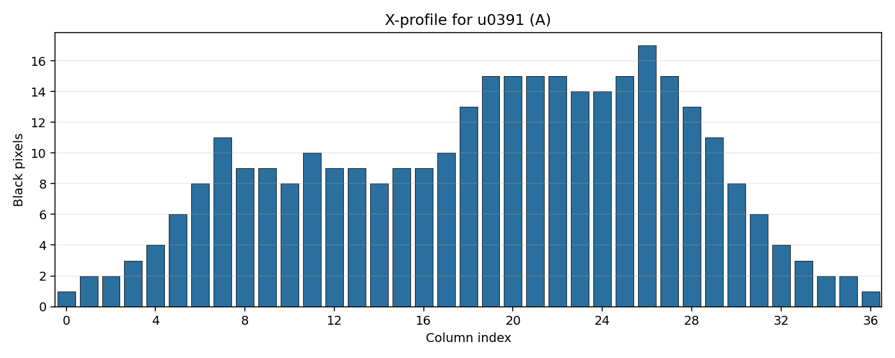 | 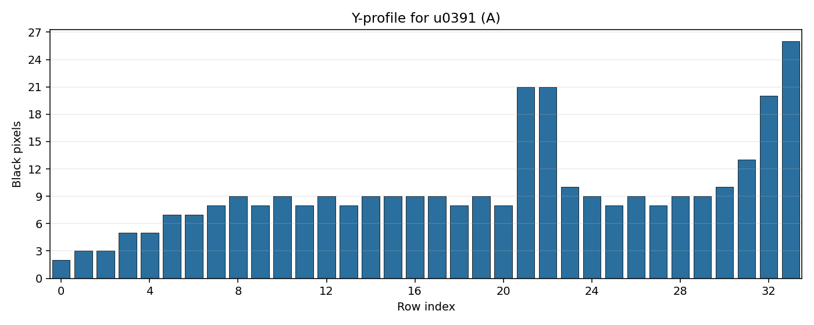 |
| Β (u0392) | 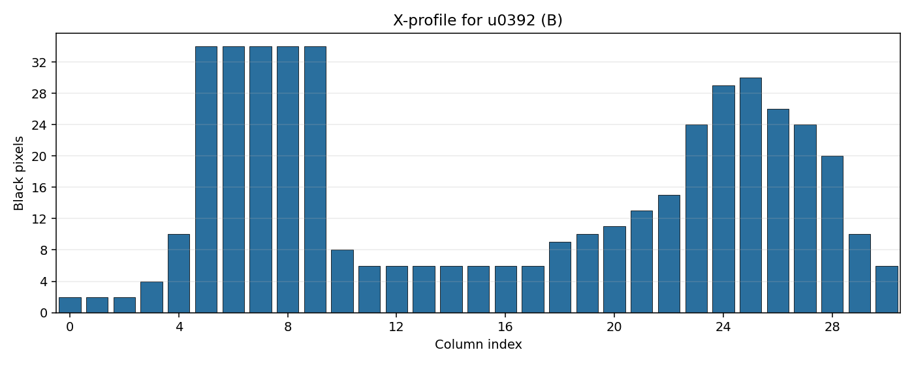 | 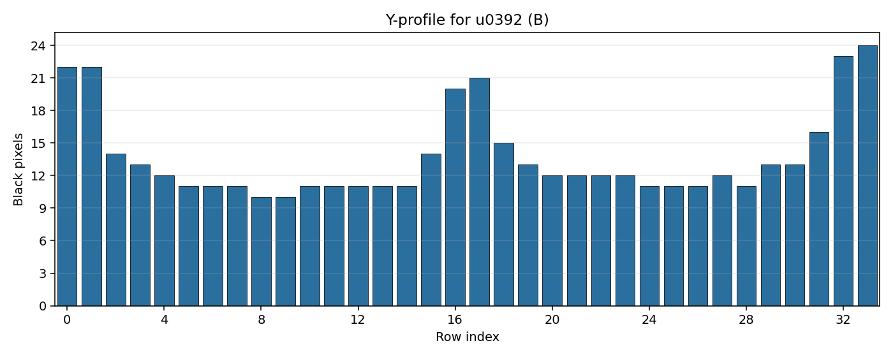 |
| Γ (u0393) | 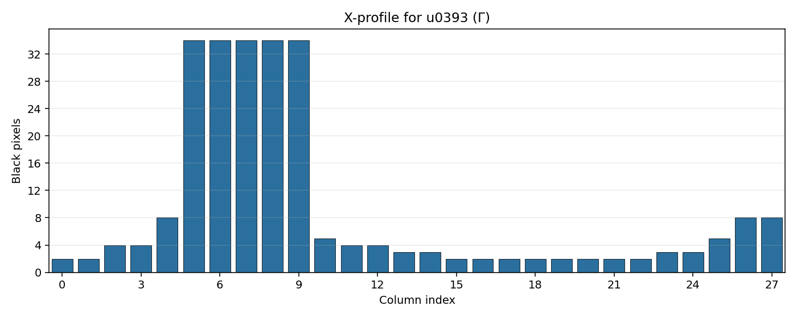 | 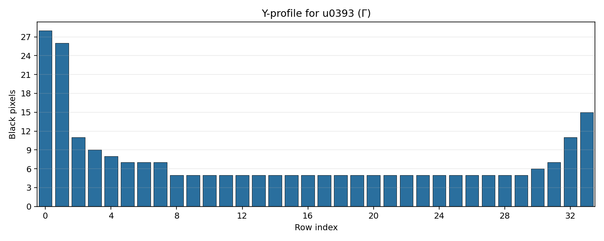 |
| Δ (u0394) | 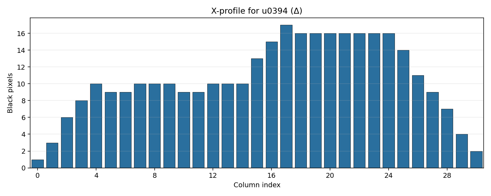 | 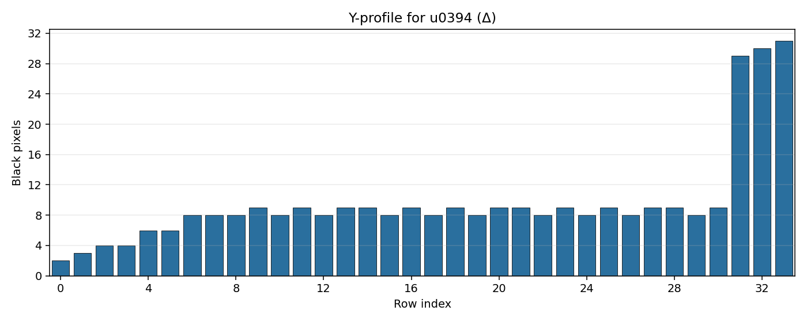 |
| Ω (u03A9) | 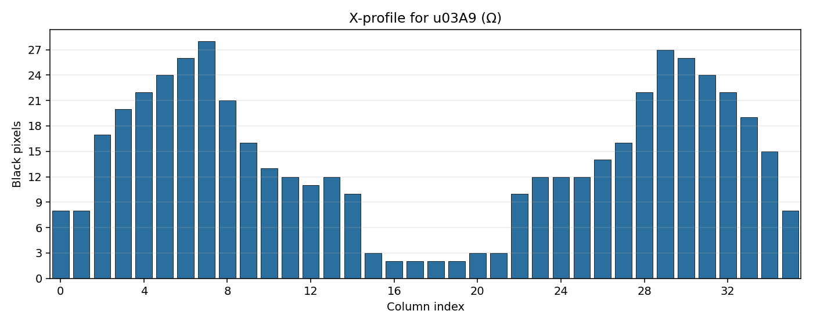 | 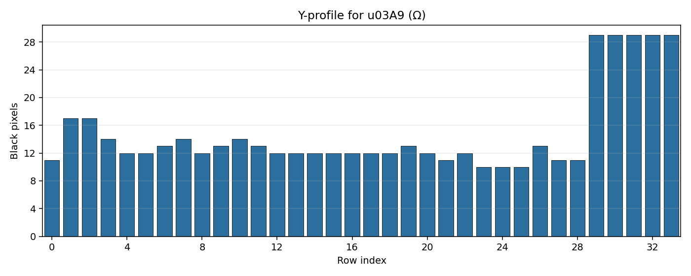 |

---

## Вывод

Выполнена лабораторная работа №5 для варианта 12: сгенерированы эталонные изображения греческих заглавных символов с обрезкой белых полей, рассчитан полный набор скалярных признаков, а также построены и сохранены профили `X` и `Y` в формате PNG. 

Результаты соответствуют требованиям задания: признаки сохранены в `CSV` с разделителем `;`, профили представлены в виде столбчатых диаграмм с корректной ориентацией и целочисленной разметкой осей.

