# Лабораторная работа №6
## Сегментация текста

**Выполнил: Лазарев Ярослав Б23-514**

**Вариант: 12 (греческие заглавные буквы)**

Алфавит: `ΑΒΓΔΕΖΗΘΙΚΛΜΝΞΟΠΡΣΤΥΦΧΨΩ`

Параметры:
- Шрифт: Times New Roman.
- Кегль: 52.
- Тестовая фраза: `ΣΕ ΑΓΑΠΩ ΠΑΝΤΑ`.

---

## 1. Подготовка входного изображения

Подготовлена строка на выбранном алфавите в монохромный файл BMP с обрезкой лишних полей вокруг текста:


Файл: `src/phrase.bmp`.

---

## 2. Расчет горизонтального и вертикального профилей

Для монохромного изображения рассчитаны:
- Горизонтальный профиль (сумма черных пикселей по строкам).
- Вертикальный профиль (сумма черных пикселей по столбцам).

Результат:

| Горизонтальный профиль | Вертикальный профиль |
|---|---|
| 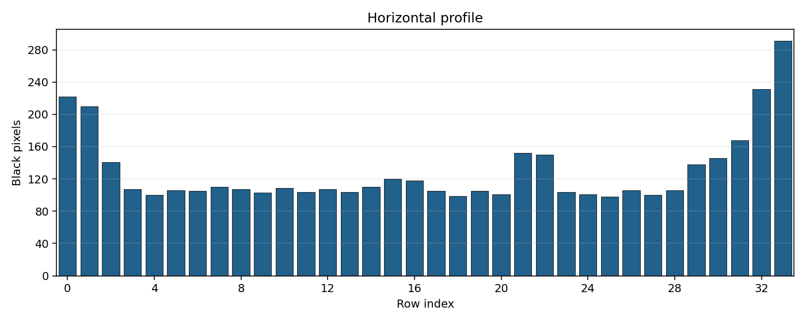 | 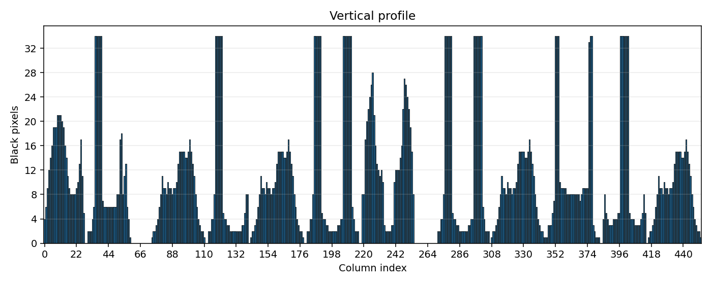 |

---

## 3. Сегментация символов по профилям с прореживанием

Реализован алгоритм:
- бинаризация профилей по порогу;
- прореживание профиля (заполнение коротких нулевых разрывов и удаление коротких шумовых участков);
- выделение диапазонов (runs) по горизонтали и вертикали;
- построение ограничивающих прямоугольников символов;
- сортировка прямоугольников в порядке чтения: слева направо, сверху вниз.

Результат сегментации (окаймляющие прямоугольники):


Вырезанные символы:

| 0 | 1 | 2 | 3 |
|---|---|---|---|
|  |  |  |  |

| 4 | 5 | 6 | 7 |
|---|---|---|---|
|  |  |  |  |

| 8 | 9 | 10 | 11 |
|---|---|---|---|
|  |  |  |  |

Координаты прямоугольников:
- `results/boxes.csv` (разделитель `;`)
- `results/boxes.json`

Фрагмент `boxes.csv`:

```text
idx;x1;y1;x2;y2;width;height
0;0;0;27;33;28;34
1;30;0;58;33;29;34
2;75;0;109;33;35;34
3;113;0;140;33;28;34
4;143;0;177;33;35;34
5;181;0;216;33;36;34
6;219;0;254;33;36;34
7;271;0;306;33;36;34
8;309;0;343;33;35;34
9;347;0;379;33;33;34
10;385;0;414;33;30;34
11;417;0;451;33;35;34
```

---

## 4. Профили символов выбранного алфавита

Построены профили `X` и `Y` для каждого символа выбранного алфавита.

Папка с результатами:
- `results/alphabet_profiles`

Примеры:

| Символ | X-профиль | Y-профиль |
|---|---|---|
| Α (u0391) | 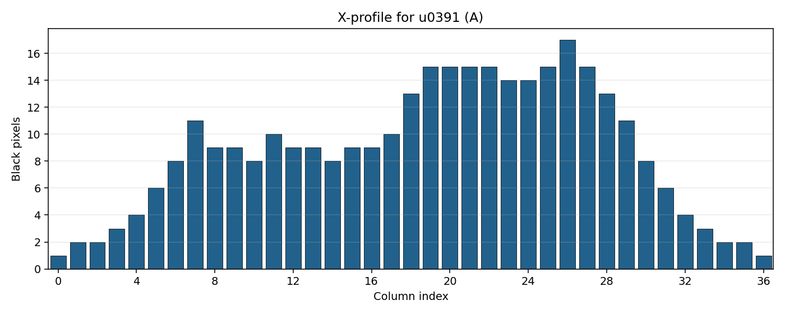 | 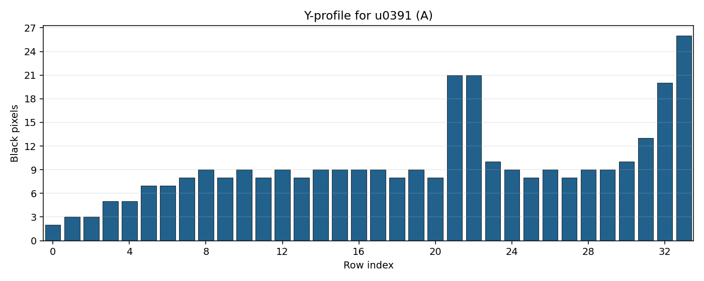 |
| Β (u0392) | 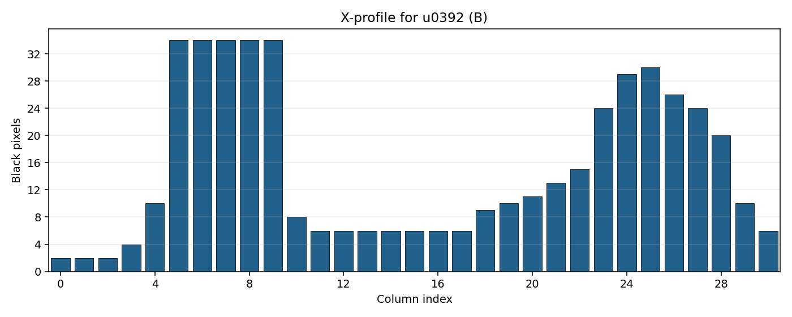 | 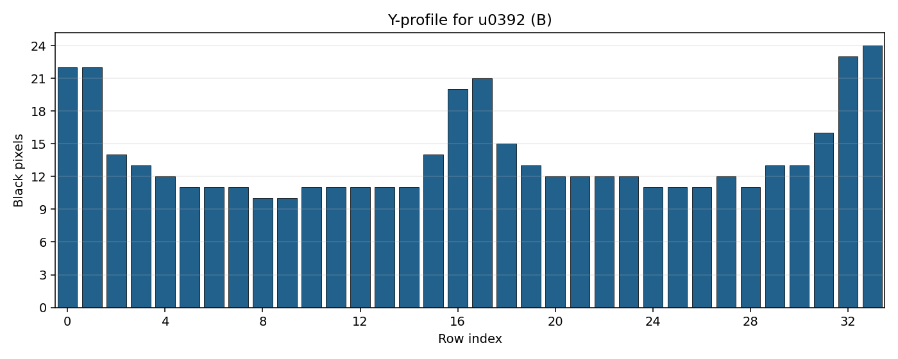 |
| Γ (u0393) | 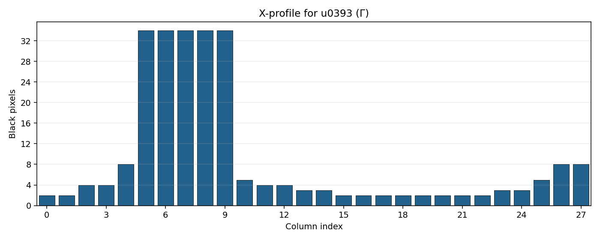 | 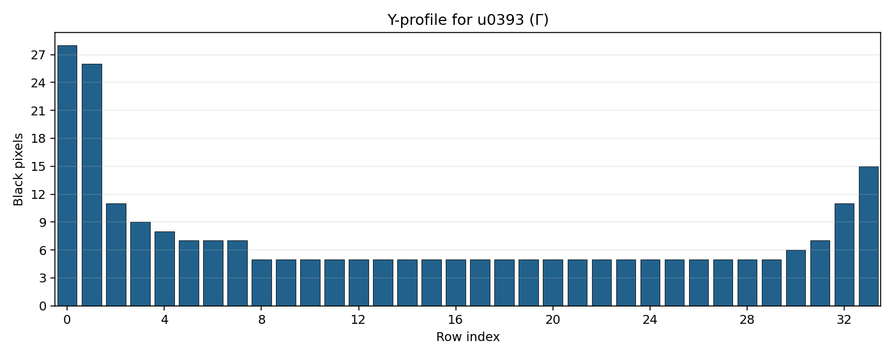 |
| Δ (u0394) | 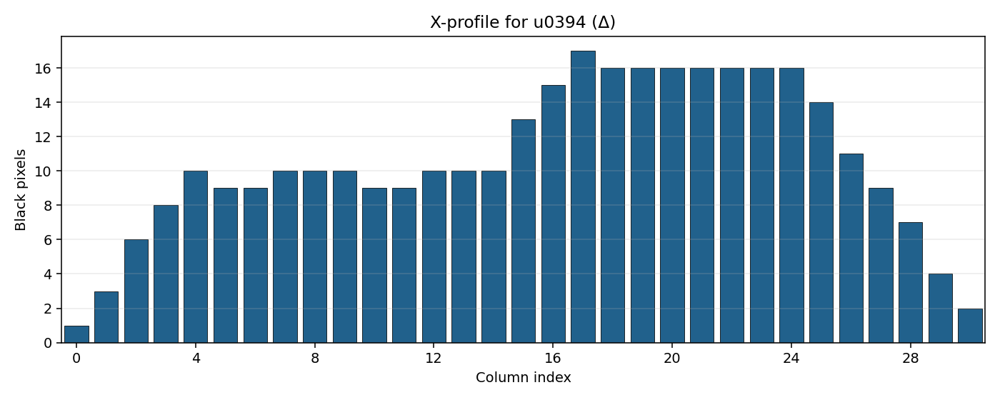 | 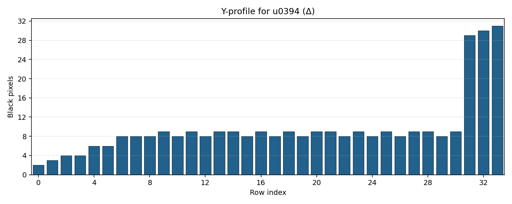 |
| Ω (u03A9) | 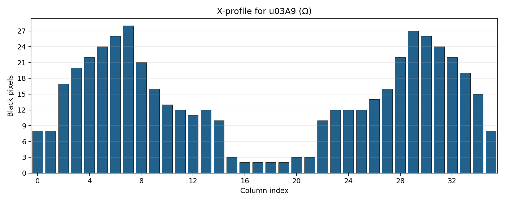 | 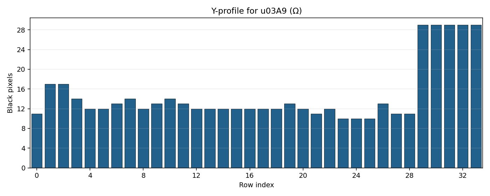 |

---

## Вывод

Выполнена лабораторная работа №6 для варианта 12: реализованы расчет горизонтального и вертикального профилей, сегментация символов на основе профилей с прореживанием, формирование массива координат ограничивающих прямоугольников в порядке чтения и визуализация результатов. Также построены профили символов выбранного алфавита.

