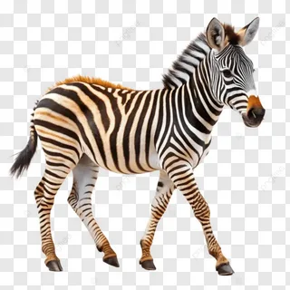
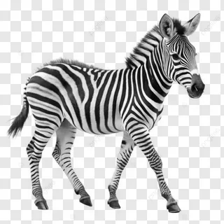
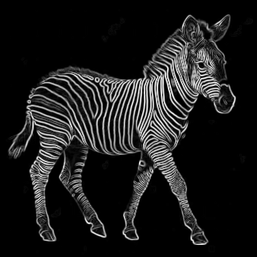
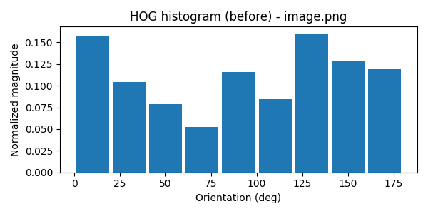
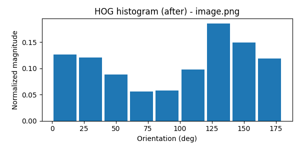
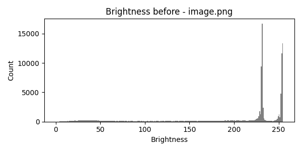
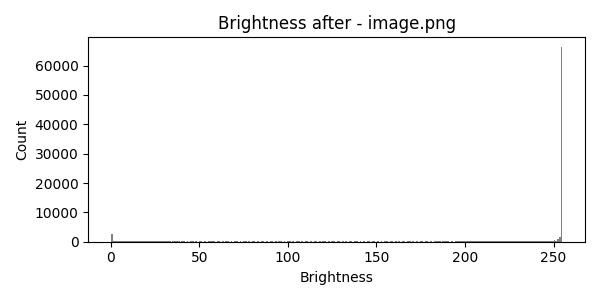

# Лабораторная работа №8
## Текстурный анализ и контрастирование

**Выполнил: Лазарев Ярослав Б23-514**

**Вариант: 12 — HOG (Контурный оператор из ЛР4), Hnorm, Линейное преобразование яркости**

Параметры:
- Контрастный линейный множитель: 1.25 (настраиваемый в `transition.py`)
- HOG: orientations=9, pixels_per_cell=(16,16), cells_per_block=(2,2)

---

## 1. Входные изображения

Входные изображения размещаются в папке проекта. Если входных изображений нет, скрипт создаёт примерное изображение (синтетический шум) для демонстрации.

---

## 2. Выполненные шаги

- Перевод в цветовую модель HSL и извлечение яркостного канала `L`.
- Вычисление оператора контура (Sobel) по каналу `L`.
- Построение HOG-описателя на основе изображения градиентов (контур).
- Линейное преобразование яркости: `L' = factor*(L-0.5)+0.5`.
- Воссоздание цветного изображения с новой яркостью (H и S сохраняются).
- Сравнение гистограмм яркости и HOG-гистограмм до и после.

---

## 3. Результаты и визуализации

Ниже приведены визуализации и краткие пояснения к ним — для каждого обработанного изображения сохранены исходная картинка, яркостный канал, визуализация оператора контура, HOG-гистограммы и гистограммы яркости до и после преобразования.
---

## 4. Замечания

- Для HSL-конверсии используется `colorsys` по пикселям; для больших изображений это можно заменить на более быстрый векторный метод.
- Линейный множитель и параметры HOG вынесены в начало `transition.py`.

---

## Примеры визуализации
Примеры визуализации для обработанного изображения `image.png`:

Исходное изображение:

Яркостный канал (L):

Оператор контура до/после:

HOG-гистограммы до/после:

Гистограммы яркости до/после:

---

## 5. Численные результаты

Параметры и метрики для `image.png`:

- Контрастный множитель: 1.25
- Средняя яркость до: 0.799
- Средняя яркость после: 0.831
- Изменение яркости (delta): +0.032

HOG (нормированная гистограмма по ориентациям) — до:

0.157, 0.104, 0.079, 0.053, 0.116, 0.085, 0.160, 0.128, 0.119

HOG — после:

0.126, 0.121, 0.089, 0.056, 0.058, 0.098, 0.185, 0.149, 0.118

Вывод: линейное контрастирование привело к небольшому увеличению средней яркости (~+0.032). HOG-гистограммы изменились преимущественно в бинах 0 и 6 (см. числа), что указывает на перераспределение направленных градиентов после контрастирования.

