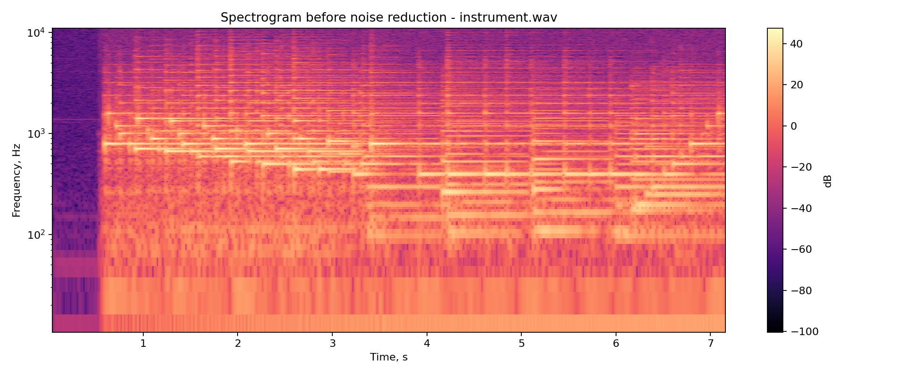
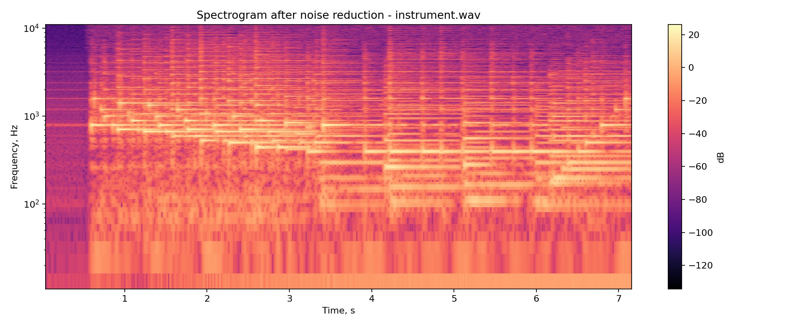
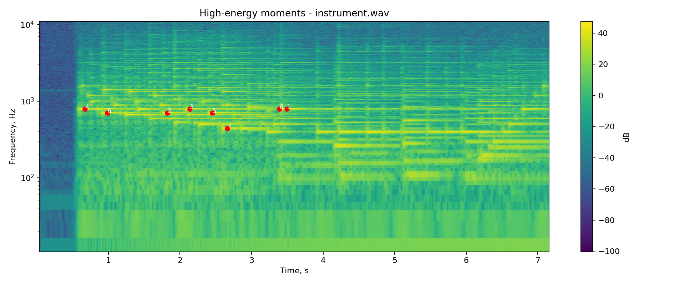

# Лабораторная работа №9. Анализ шума

## Цель
Исследовать спектрограмму записи музыкального инструмента, оценить шум и восстановить дорожку после подавления шума. Дополнительно найти моменты с наибольшей локальной энергией.

## Исходные данные
Использована запись [instrument.wav](instrument.wav).

## Ход обработки
- Построена спектрограмма с окном Ханна.
- Выполнено спектральное вычитание оценки шума.
- Восстановлена дорожка в WAV.
- Найдены моменты с наибольшей локальной энергией при шаге по времени 0,1 с и по частоте около 45 Гц.

## Результаты
Приведены спектрограммы до и после шумоподавления, карта локальной энергии и восстановленная звуковая дорожка.

Восстановленная звуковая дорожка: [instrument_restored.wav](results/instrument_restored.wav).

## Численные оценки
- Длительность записи: 7,20 с.
- Частота дискретизации: 22050 Гц.
- RMS до шумоподавления: 0,1673.
- RMS после шумоподавления: 0,0149.
- Оценка шума по спектру: 0,0567.
- Наиболее энергоемкие участки наблюдаются около 0,67 с, 0,99 с, 1,82 с, 2,14 с, 2,45 с, 2,66 с, 3,39 с и 3,49 с; основная энергия лежит в области 442–786 Гц.

## Вывод
Подавление шума заметно снизило RMS-составляющую записи, а спектрограмма стала более разреженной по фону. Наиболее энергоемкие участки лежат в областях, характерных для основных гармоник и атаки звука инструмента, что подтверждает пригодность записи для спектрального анализа.